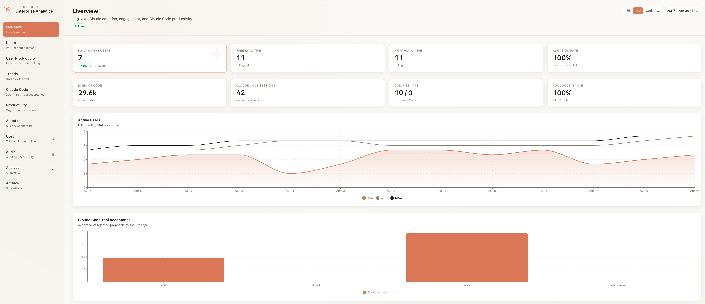
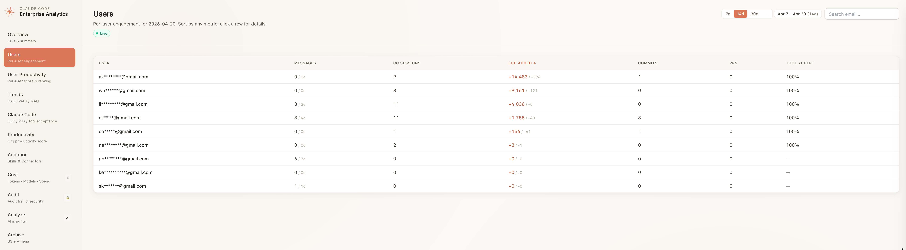
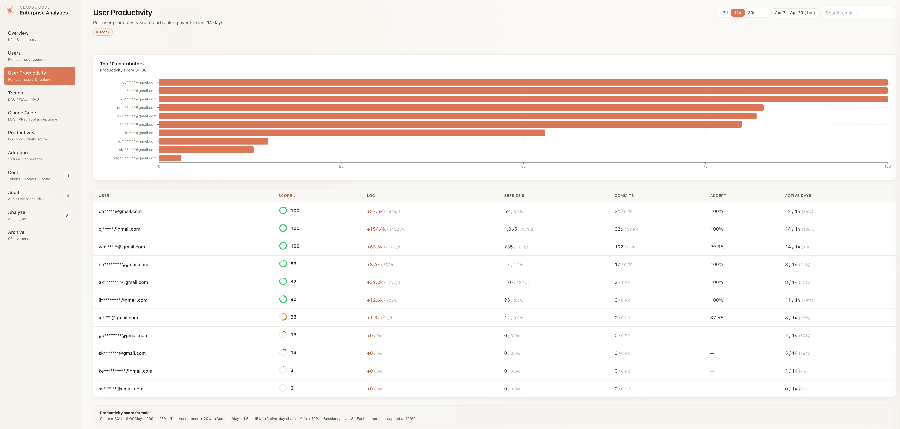
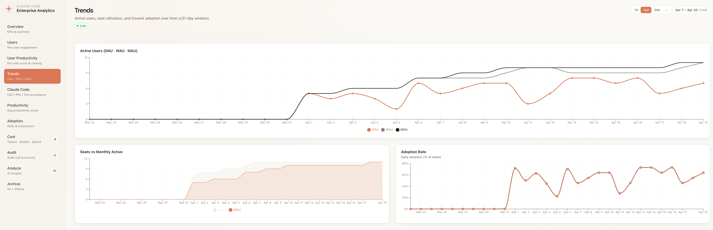
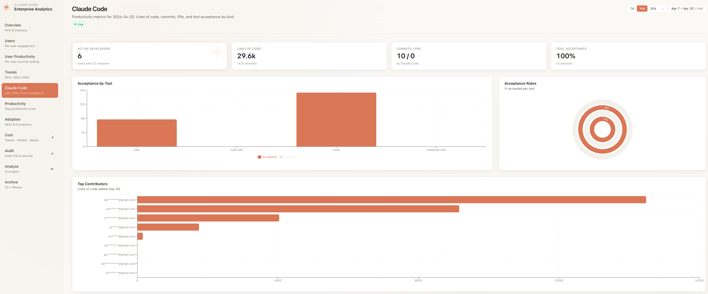
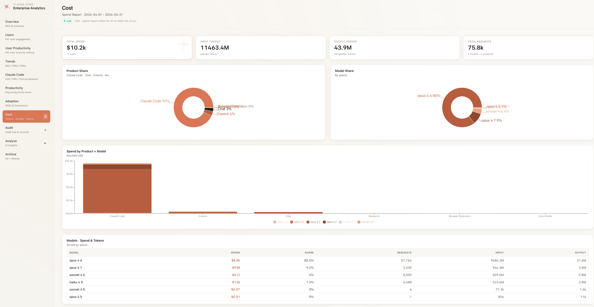
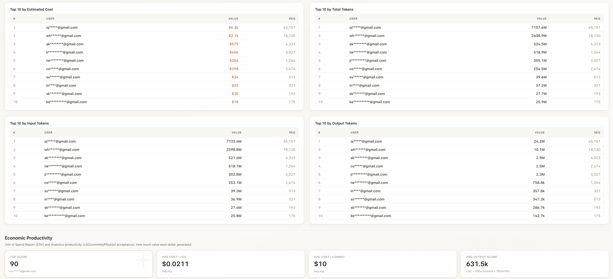
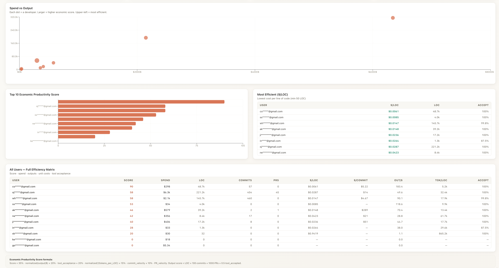
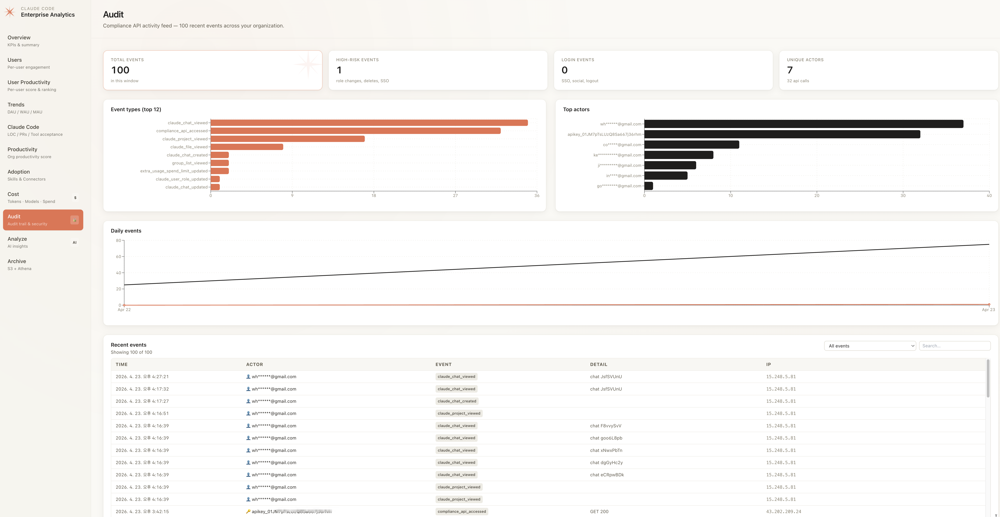
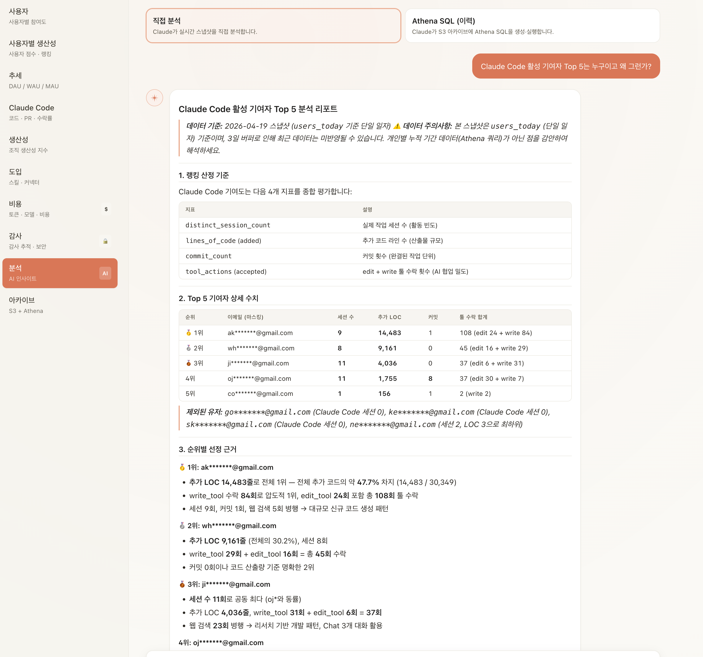

# claude-code-dashboard

[](./LICENSE)
[](./CHANGELOG.md)
[](./README.md)

Claude Code 엔터프라이즈 애널리틱스 대시보드 — 참여도·생산성·비용·감사 지표를 통합하고 AI 질의응답 레이어를 제공합니다.

> 🇺🇸 English version: **[README.md](./README.md)**

## 화면

각 페이지에 표시되는 모든 지표는 [`docs/metrics-catalog.md`](./docs/metrics-catalog.md)에서 확인할 수 있습니다.

**페이지 목차** — [개요](#개요) · [사용자](#사용자) · [사용자별 생산성](#사용자별-생산성) · [추세](#추세) · [Claude Code](#claude-code) · [생산성](#생산성) · [비용](#비용) · [감사](#감사) · [AI 분석](#ai-분석)

---

### 개요

**목적** — 조직 건강도 요약: 누가 활동 중인지, 얼마나 많은 코드가 생산되는지, AI 제안이 얼마나 잘 수락되는지.

- **KPI**: 일일 활성 사용자 · 주간 활성 · 월간 활성 · 도입률 · 코드 라인 · CC 세션 · 커밋/PR · 도구 수락률
- **차트**: DAU/WAU/MAU 누적 영역 차트 · Claude Code 도구 수락률 (도구별 누적 막대)
- **데이터 소스**: Analytics API `/summaries` + `/users`



---

### 사용자

**목적** — 사용자별 참여도 랭킹. 행 클릭 시 우측 슬라이드인 패널로 7일치 추이.

- **칼럼**: 메시지 · CC 세션 · 추가된 LOC · 커밋 · PR · 도구 수락률
- **상호작용**: 행 클릭 → 7일 추세 차트(LOC/세션/메시지) + 도구별 수락률 + 일별 상세 테이블
- **개인정보 보호**: 모든 이메일은 `maskEmail()`로 마스킹 처리 — `ab*****@domain.com`
- **데이터 소스**: Analytics API `/users` (오늘)



---

### 사용자별 생산성

**목적** — Analytics 산출 + Spend Report 비용을 결합한 사용자별 생산성 점수와 랭킹.

- **점수 공식**: `0.30·LOC/일 + 0.25·수락률 + 0.20·커밋/일 + 0.15·활성일 비율 + 0.10·세션/일` — 각 항목 0~1 클램프 후 × 100
- **구성**: Top 10 수평 막대 차트 + 정렬 가능한 매트릭스 (점수 · LOC · 세션 · 커밋/PR · 수락률 · 활성일)
- **데이터 소스**: Analytics API `/users/range` (S3 우선 조회, 선택 기간 fan-out)



---

### 추세

**목적** — 조직 레벨 도입 추이. 최대 31일 구간 시계열.

- **차트**: DAU/WAU/MAU 라인 · 좌석 대비 MAU 누적 영역 · 일일 도입률 라인 (API 제공값)
- **컨트롤**: 7일/14일/30일 프리셋 + 커스텀 날짜 선택기. URL 쿼리 파라미터로 공유 가능
- **데이터 소스**: Analytics API `/summaries`



---

### Claude Code

**목적** — Claude Code CLI 생산성 — 작성/커밋/머지된 결과.

- **KPI**: 활성 개발자 · 코드 라인 (추가/제거) · 커밋/PR · 도구 수락률
- **차트**: 도구별 수락 누적 막대 · 도구별 수락 비율 Radial · Top 10 기여자 (LOC 기준)
- **데이터 소스**: Analytics API `/users` → `claude_code_metrics.*`


---

### 생산성

**목적** — 조직 전체 복합 생산성 지표와 추세 차트.

- **점수 KPI**: 원형 게이지 (빨강 <40 / 주황 <70 / 녹색 ≥70)
- **추세 차트**: LOC 추가/제거 · 커밋 & PR · 도구 수락률 · 활성 개발자 & 세션 (복합 차트)
- **데이터 소스**: Analytics API `/users/range` (S3 아카이브 우선)



---

### 비용

**목적** — 토큰 소비·모델/제품별 지출·사용자 랭킹, 그리고 Spend Report CSV × Analytics 산출을 결합한 **경제 생산성 점수**.

| 섹션 | 내용 |
|------|------|
| 상단 (`cost01.png`) | KPI (총 지출 · Input · Output · 요청) · 모델별 점유 파이 차트 · 모델별 점유율/input/output 표 |
| 중단 (`cost02.png`) | 제품 × 모델 지출 누적 막대 · 토큰 유형별 사용량 (누적 영역) · 모델별 일일 비용 · Top 10 사용자 (total/input/output/지출) |
| 하단 (`cost03.png`) | **경제 생산성 점수** 섹션: 지출 vs 산출 산점도 · Top 10 점수 · 최고 효율 ($/LOC) · 전체 효율 매트릭스 (사용자별) |

- **데이터 소스**: Spend Report CSV (`s3://<archive>/spend-reports/`에 업로드) + Analytics API `/users/range` 조인
- **경제 점수 공식**: `0.35·N(output/$) + 0.20·수락률 + 0.20·N(1/tokens/LOC) + 0.15·commit_velocity + 0.10·PR_velocity`
- **Output 점수**: `LOC + 100·commits + 1000·PRs + 0.5·tool_accepted`

<table>
  <tr><td width="33%" align="center"><a href="./screenshots/cost01.png"></a><br/><sub>① KPI + 모델별 점유</sub></td>
      <td width="33%" align="center"><a href="./screenshots/cost02.png"></a><br/><sub>② 추세 + Top 10</sub></td>
      <td width="33%" align="center"><a href="./screenshots/cost03.png"></a><br/><sub>③ 경제 생산성</sub></td></tr>
</table>

---

### 감사

**목적** — Compliance API 이벤트 피드, 위험 이벤트 자동 분류.

- **KPI**: 전체 이벤트 · 고위험 이벤트 · 로그인 이벤트 · 고유 행위자
- **차트**: 이벤트 타입 Top 12 막대 · 상위 행위자 막대 · 일자별 전체/위험 이벤트 라인
- **피드**: 시간/행위자/이벤트/상세/IP 컬럼. 위험 이벤트는 Claude 톤 배경색으로 강조. 드롭다운 + 검색창으로 이벤트 타입/행위자 필터링.
- **분류**: 위험 (역할 변경 · SSO 토글 · 데이터 export · 프로젝트 삭제) · 로그인 (SSO/소셜/로그아웃) · 활동 (채팅/파일/프로젝트 작업)
- **데이터 소스**: Compliance API `/v1/compliance/activities`



---

### AI 분석

**목적** — 실시간 analytics + 아카이브 SQL에 대한 자연어 질의. Amazon Bedrock의 Claude Sonnet 4.6이 SSE로 스트리밍 응답.

- **두 가지 모드**:
  - `Direct` — Claude가 현재 실시간 스냅샷(summaries + users + skills + connectors) 직접 분석
  - `Athena SQL` — Claude가 sanitize된 Athena SQL을 자율 생성, 실행 후 결과를 리포트로 작성
- **스트리밍 UX**: 상태 chip ("SQL 생성 중" → "Athena 실행 중" → "분석 작성 중") · `react-markdown@10` + `remark-gfm` 기반 점진적 마크다운 렌더링
- **안전성**: `sanitizeAthenaQuery` sanitizer가 사용자 SQL과 LLM 생성 SQL 모두에 대해 SELECT 전용 + 테이블 allowlist 강제
- **로케일 인식**: 영어 locale → 영문 마크다운 리포트, 한국어 locale → 한국어 마크다운 리포트 (헤딩/표 포맷 동일)
- **데이터 소스**: Bedrock Runtime (ConverseStream) + 실시간 Analytics API 스냅샷 + (SQL 모드) Athena



---

## 개요

`claude-code-dashboard`는 Anthropic **Analytics**, **Admin**, **Compliance** API에 더해 업로드된 Spend Report CSV와 일일 S3 아카이브를 결합해 하나의 CloudFront 프론트 대시보드로 제공합니다. 다섯 가지 질문에 동시에 답합니다: *누가 Claude를 쓰는가?*, *얼마나 생산적인가?*, *얼마를 쓰고 있는가?*, *무슨 활동을 했는가(감사)?*, *데이터가 무엇을 의미하는가?* (Amazon Bedrock 기반 AI 분석). 페이지별 화면은 상단 [화면](#화면) 섹션을 참고하세요.

아키텍처는 [kiro-dashboard](https://github.com/whchoi98/kiro-dashboard) 레퍼런스 스택과 동일합니다: CloudFront → WAF → ALB → ECS Fargate (프라이빗 서브넷) → NAT → 외부 API. 그 아래 S3 / Glue / Athena가 90일 Analytics API 윈도우 이후의 장기 보관을 담당합니다.

## 주요 기능

- **11개 페이지** — 개요 · 사용자(드릴다운) · 사용자별 생산성 · 추세 · Claude Code · 생산성 · 도입 · 비용 · 감사 · 분석(AI) · 아카이브.
- **세 개의 API 통합** — Analytics, Admin, Compliance (각각 별도 Secrets Manager 시크릿으로 주입; 모두 선택적이며 키가 없어도 UI는 graceful하게 동작).
- **S3-우선 데이터 레이어** — Lambda collector가 매일 Analytics API 스냅샷을 파티셔닝된 NDJSON으로 S3에 저장합니다. 조회는 S3 먼저(~150 ms), 캐시 miss 시에만 실제 API fallback.
- **AI 자연어 질의** — Amazon Bedrock(Claude Sonnet 4.6 cross-region 프로파일) 기반 SSE 스트리밍. 두 모드: 실시간 스냅샷 직접 분석, 자율 Athena SQL 생성 + 실행.
- **Cognito + Lambda@Edge 인증** — 모든 대시보드 URL이 Cognito Hosted UI 로그인을 거쳐야 접근 가능. 네 개의 viewer-request Lambda@Edge 함수(`check-auth`, `parse-auth`, `refresh-auth`, `sign-out`)가 모든 CloudFront PoP에서 실행됨. 미인증 트래픽은 WAF · ALB · ECS에 도달하기 전에 차단. [ADR-0001](docs/decisions/0001-cognito-lambda-edge-auth.md) 참조.
- **셀프서비스 CSV 업로드** — 비용 페이지에서 Spend Report CSV 업로드 / 목록 / 삭제를 브라우저로 직접 수행 — 클라이언트 프리뷰 + 기간 중복 경고 포함. AWS CLI 권한 불필요. [ADR-0002](docs/decisions/0002-dashboard-csv-upload.md) 참조.
- **경제 생산성 점수** — Spend Report CSV와 Analytics 생산성을 결합해 `달러당 output` 기준 사용자 랭킹 제공. 비용 페이지의 기간 선택 컨트롤은 이 섹션만 갱신하고 CSV 네이티브 집계는 그대로 유지.
- **이중 언어 UI** — 영/한 실시간 토글 (localStorage 저장).
- **기본 개인정보 보호** — 모든 이메일을 마스킹해 표시 (`co*****@gmail.com`).
- **감사 추적** — Compliance API 이벤트 피드 + 위험 이벤트 하이라이트 (역할 변경, SSO 토글, 데이터 export 등).

## 사전 요구 사항

- Node.js 20 이상
- Docker (CDK 이미지 자산 빌드용)
- AWS CLI v2 + 대상 계정 자격 증명
- AWS CDK v2.170 이상
- 선택: Anthropic Analytics / Admin / Compliance API 키

## 설치 방법

```bash
# 클론
git clone https://github.com/whchoi98/claude-code-dashboard.git
cd claude-code-dashboard

# 전체 워크스페이스 설치
npm install
(cd infra && npm install)
(cd collector && npm install)

# 로컬 환경 설정
cp .env.example .env
# .env 편집 — 최소한 ANTHROPIC_ANALYTICS_KEY 설정

# 로컬 실행 (Vite 5173 + Express 5174 동시 실행)
npm run dev
```

## 사용법

```bash
# SPA 빌드 + Express 프로덕션 모드
npm run build
npm run server
# → http://localhost:5174

# AWS 배포 (EIP 쿼터 문제 회피를 위해 기존 VPC 재사용)
cd infra
npx cdk deploy --all --require-approval never \
  --context existingVpcId=vpc-xxxxxxxxxxxxxxxxx

# 배포 후 Secrets Manager에 API 키 주입
aws secretsmanager put-secret-value --secret-id ccd/analytics-key \
  --secret-string 'sk-ant-api01-...'
```

## 환경 설정

| 변수 | 설명 | 기본값 |
|------|------|--------|
| `ANTHROPIC_ANALYTICS_KEY` | Enterprise Analytics API 키 (sk-ant-api01-… Analytics scope) | (live 모드 필수) |
| `ANTHROPIC_ADMIN_KEY_ADMIN` | Admin API 키 (sk-ant-admin01-…) — 비용 페이지 활성화 | (선택) |
| `ANTHROPIC_COMPLIANCE_KEY` | Compliance API 키 (sk-ant-api01-… Compliance scope) | (선택) |
| `AWS_REGION` | Bedrock / Athena / S3 리전 | `ap-northeast-2` |
| `BEDROCK_MODEL_ID` | Bedrock 파운데이션 모델 또는 inference profile | `global.anthropic.claude-sonnet-4-6` |
| `ARCHIVE_S3_BUCKET` | NDJSON 아카이브 + spend report용 S3 버킷 | (CDK가 설정) |
| `ATHENA_WORKGROUP` | Athena 워크그룹 이름 | `claude-code-dashboard` |
| `ATHENA_DATABASE` | Glue 데이터베이스 이름 | `claude_code_analytics` |
| `ATHENA_OUTPUT_LOCATION` | Athena 쿼리 결과 S3 URI | (CDK가 설정) |
| `PORT` | Express 리스닝 포트 | `5174` (개발) / `8080` (컨테이너) |

## 프로젝트 구조

```
claude-code-dashboard/
├── src/                    # React SPA (Vite)
│   ├── components/         # 공용 UI, DateRangeControl, UserDetailPanel
│   ├── pages/              # 11개 라우트
│   ├── lib/                # i18n, useFetch, useDateRange, 포맷팅
│   └── types.ts            # API 스키마 타입
├── server/                 # Express 프록시 + AWS 통합
│   ├── index.js            # /api/analytics/*, /api/admin/*, /api/compliance/*
│   ├── aws.js              # Bedrock SSE, Athena, CSV 파싱, efficiency join
│   └── mock.js             # 로컬 개발용 결정론적 목업
├── collector/              # 일일 Lambda — Analytics API → S3 NDJSON
├── infra/                  # AWS CDK (TypeScript) — 4개 스택
├── docs/                   # 아키텍처 · ADR · 런북
├── tests/                  # 하니스 테스트 (hook, 구조, secret)
└── scripts/                # setup.sh, install-hooks.sh
```

## 월간 예상 비용 (ap-northeast-2)

하나의 프로덕션 배포에 대한 월간 AWS 청구 예상치입니다. **기본값 ECS 2 태스크**, **기존 VPC 재사용 패턴**(NAT Gateway 신규 생성 없음), 경량~중간 대시보드 트래픽을 가정합니다.

| 리소스 | 스펙 | 월간 비용 |
|--------|------|-----------|
| Application Load Balancer | ALB 1개 + 적은 LCU | 약 $22 |
| AWS WAF (Regional) | Web ACL 1개 + 관리형 룰 그룹 2개 + rate 룰 | 약 $9 |
| ECS Fargate | ARM64 2 태스크 · 0.5 vCPU · 1 GB · 24/7 | 약 $30 |
| Secrets Manager | 시크릿 3개 (Analytics / Admin / Compliance) | 약 $1.20 |
| S3 archive | NDJSON < 1 GB + versioning | 약 $0.05 |
| CloudWatch Logs | 30일 보존, 월 약 1 GB | 약 $1 |
| Glue Data Catalog | 4 테이블 + 파티션 projection | 약 $1 |
| Athena | Ad-hoc 쿼리, 월 약 10 GB 스캔 | 약 $1 |
| CloudFront | 무료 티어 50 GB로 대부분 커버 | 약 $1-3 |
| Lambda 컬렉터 + EventBridge | 월 30회 호출 · 512 MB · 30초 평균 | 약 $0 (free tier) |
| **고정 소계** | | **약 $66 – 70** |
| Bedrock (Claude Sonnet 4.6) | 월 50회 분석 (~$0.20/회) | 약 $10 |
| Bedrock (많이 사용) | 월 500회 분석 | 약 $100 |
| Fargate 오토스케일 피크 | 스파이크 시 최대 6 태스크 | +$10 – 40 |
| Data transfer (CloudFront out) | 월 약 10 GB | 약 $1 |
| **총합 (경량)** | 월 100회 미만 분석, 2 태스크 고정 | **월 약 $80** |
| **총합 (중간)** | 월 200~500회 분석, 가끔 피크 | **월 약 $130** |
| **총합 (많이 사용)** | 월 1,000회 이상 분석, 잦은 스케일업 | **월 약 $250** |

`existingVpcId` 컨텍스트 없이 CDK가 새 VPC를 만들게 두면 NAT Gateway 비용 **월 약 $43** 추가됩니다.

가입 후 12개월 이내의 AWS Free Tier 계정은 더 저렴합니다 (CloudFront 50 GB, 일부 Lambda 호출 무료). Fargate는 free tier가 없습니다. 기본 비용을 더 줄이려면 ECS 서비스를 1 태스크로 축소하면 약 $15 절감되지만 롤링 배포 여유가 사라집니다.

## 테스트

```bash
# 타입 체크
npx tsc --noEmit

# 프로덕션 빌드
npx vite build

# 서버 문법 검사
node --check server/index.js server/aws.js server/mock.js collector/handler.js

# CDK synth
(cd infra && npx cdk synth --context existingVpcId=vpc-xxxxxxxxxxxxxxxxx)

# 하니스 테스트 스위트
bash tests/run-all.sh
```

## API 문서

Express 프록시가 노출하는 전체 라우트는 [docs/api-reference.md](./docs/api-reference.md)를 참고합니다.

## 기여 방법

1. 저장소를 fork합니다.
2. 기능 브랜치를 생성합니다: `git checkout -b feat/short-description`.
3. [Conventional Commits](https://www.conventionalcommits.org/) 형식으로 커밋합니다 — 예: `feat: 사용자별 토큰 히트맵 추가` 또는 `fix: 도입 페이지의 이메일 마스킹`.
4. Push 후 `main`을 대상으로 PR을 엽니다.
5. `/test-all`이 통과하는지 확인하고 PR 체크리스트를 채웁니다.

## 라이선스

[MIT License](./LICENSE) 하에 배포됩니다.

## 연락처

- 메인테이너: [@whchoi98](https://github.com/whchoi98)
- 이슈 트래커: [github.com/whchoi98/claude-code-dashboard/issues](https://github.com/whchoi98/claude-code-dashboard/issues)
