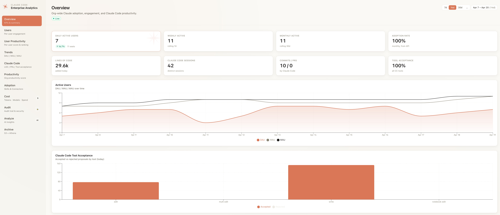
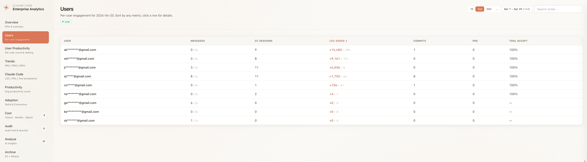
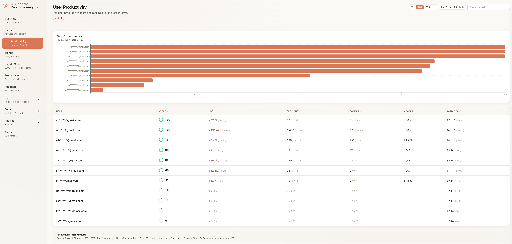
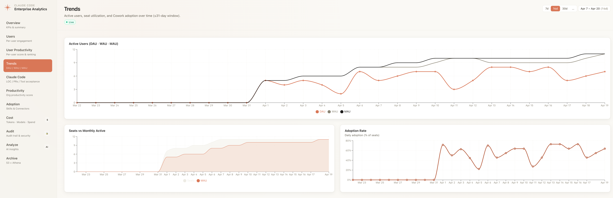
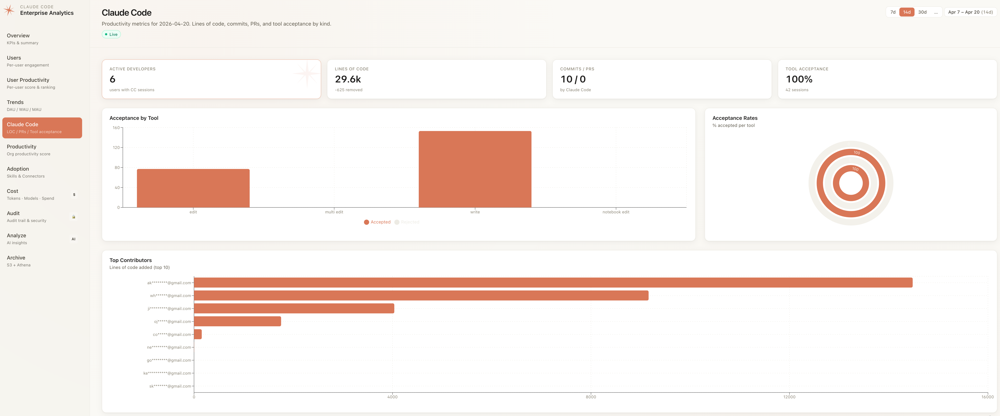
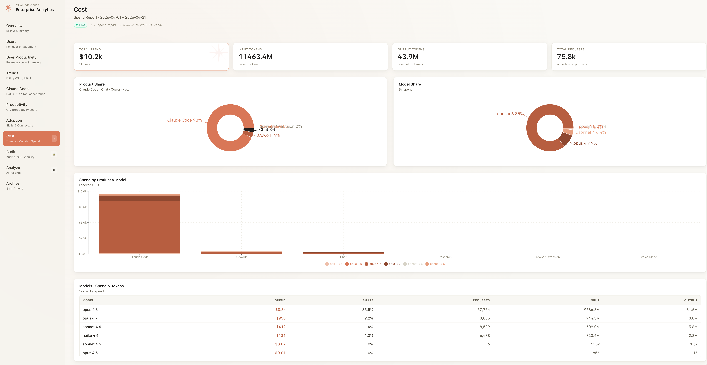
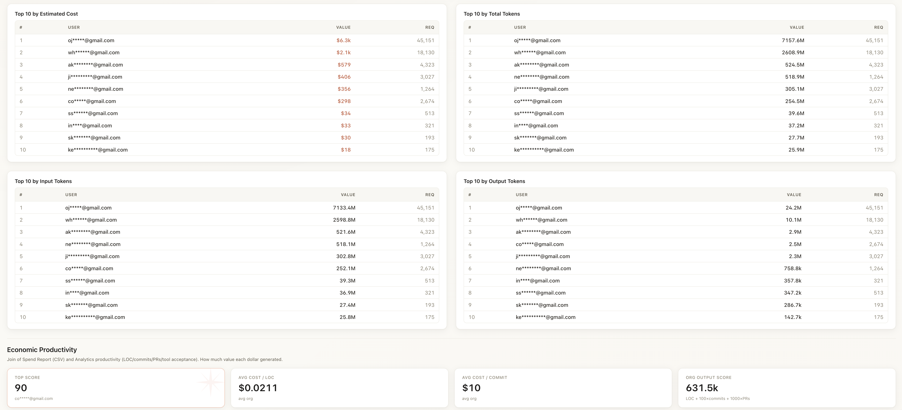
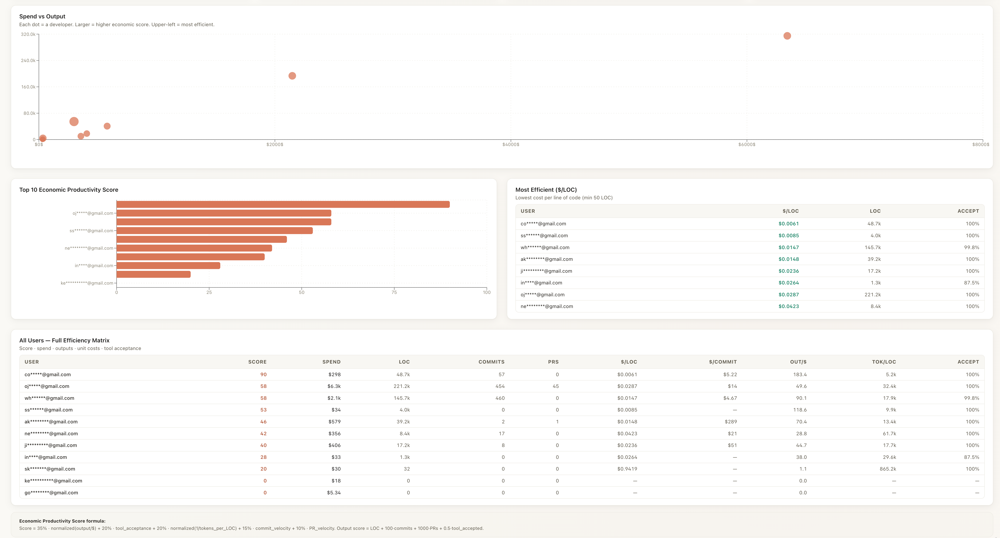
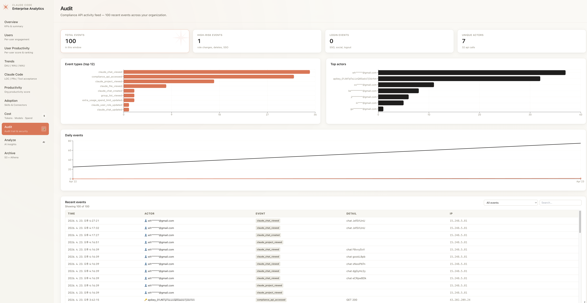
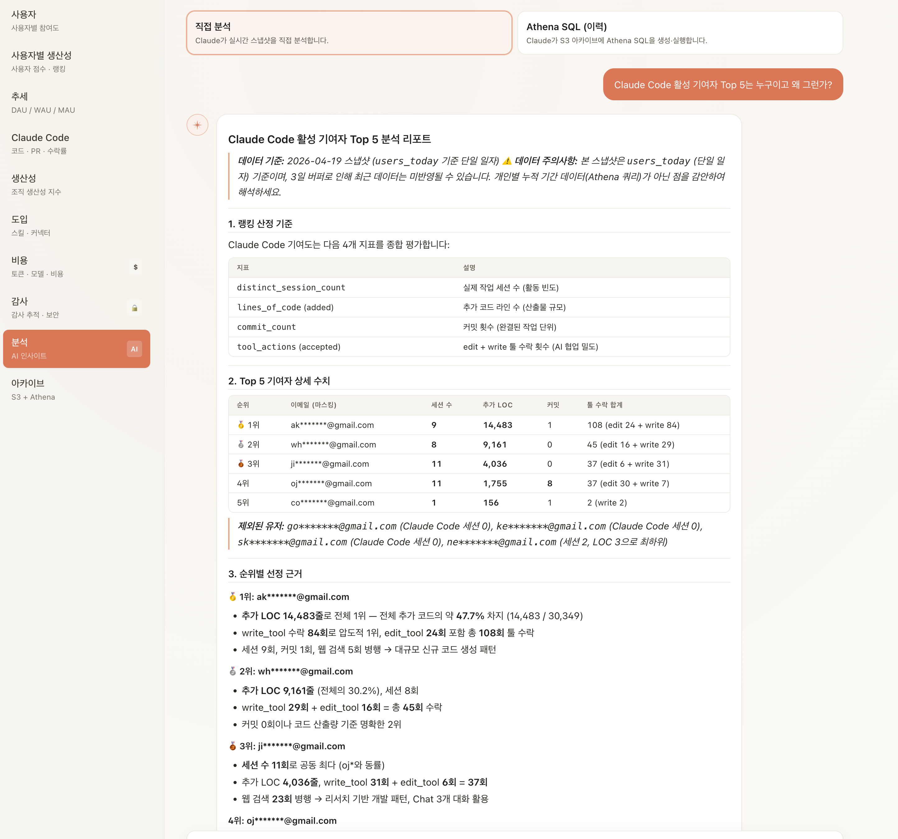

# claude-code-dashboard

[](https://opensource.org/license/mit/)
[](./CHANGELOG.md)
[](./README.md)

Claude Code 엔터프라이즈 애널리틱스 대시보드 — 참여도·생산성·비용·감사 지표를 통합하고 AI 질의응답 레이어를 제공합니다.

> 🇺🇸 English version: **[README.md](./README.md)**
> 🌐 온라인 브로셔 (GitHub Pages): **https://whchoi98.github.io/claude-code-dashboard/**

## 화면

각 페이지에 표시되는 모든 지표는 [`docs/metrics-catalog.md`](./docs/metrics-catalog.md)에서 확인할 수 있습니다.

**페이지 목차** — [개요](#개요) · [경영 요약](#경영-요약) · [사용자](#사용자) · [사용자별 생산성](#사용자별-생산성) · [사용자 검색](#사용자-검색) · [추세](#추세) · [Claude Code](#claude-code) · [생산성](#생산성) · [에이전틱](#에이전틱) · [도입](#도입) · [비용](#비용) · [감사](#감사) · [AI 분석](#ai-분석) · [아카이브](#아카이브) · [변경 내역](#변경-내역)

---

### 개요

**목적** — 조직 건강도 요약: 누가 활동 중인지, 얼마나 많은 코드가 생산되는지, AI 제안이 얼마나 잘 수락되는지.

- **KPI**: 일일 활성 사용자 · 주간 활성 · 월간 활성 · 도입률 · 코드 라인 · CC 세션 · 커밋/PR · 도구 수락률
- **차트**: DAU/WAU/MAU 누적 영역 차트 · Claude Code 도구 수락률 (도구별 누적 막대)
- **데이터 소스**: Analytics API `/summaries` + `/users`



---

### 사용자

**목적** — 사용자별 참여도 랭킹. 행 클릭 시 우측 슬라이드인 패널로 기간 드릴다운(활동·지출·스킬).

- **칼럼**: 메시지 · CC 세션 · 추가된 LOC · 커밋 · PR · 도구 수락률
- **상호작용**: 행 클릭 → 페이지 기간을 따르는 드릴다운 패널: 활동 추이(LOC/세션/메시지) + 도구별 수락률 + 일별 테이블, 그리고 제품별·모델별 지출(본인 총액 대비 %, 동일 길이 이전 기간 대비 Δ)과 스킬 카드(조직 주요 스킬 사용당 비용 — API에 사용자×스킬 차원 없음)
- **개인정보 보호**: 모든 이메일은 `maskEmail()`로 마스킹 처리 — `ab*****@domain.com`
- **데이터 소스**: Analytics API `/users` (오늘)



---

### 사용자별 생산성

**목적** — Analytics 참여도 기반 사용자별 활동 점수와 랭킹. 비용 효율은 비용 페이지에서 별도로 제공합니다.

- **점수 공식**: `0.30·LOC/일 + 0.25·수락률 + 0.20·커밋/일 + 0.15·활성일 비율 + 0.10·세션/일` — 각 항목 0~1 클램프 후 × 100
- **구성**: Top 10 수평 막대 차트 + 정렬 가능한 매트릭스 (점수 · LOC · 세션 · 커밋/PR · 수락률 · 활성일)
- **데이터 소스**: Analytics API `/users/range` (S3 우선 조회, 선택 기간 fan-out)



---

### 추세

**목적** — 조직 레벨 도입 추이. 최대 366일 구간 시계열.

- **차트**: DAU/WAU/MAU 라인 · **제품별 활성 사용자**(Claude Code · Chat · Cowork · Claude Design · Office Agents · Claude Science, DAU/WAU/MAU 전환. 조직에 보고되지 않는 제품은 표시하지 않음) · 좌석 대비 MAU 누적 영역 · 일일 도입률 라인 (API 제공값)
- **컨트롤**: 7일/14일/30일 프리셋 + 커스텀 날짜 선택기. URL 쿼리 파라미터로 공유 가능
- **데이터 소스**: Analytics API `/summaries`



---

### Claude Code

**목적** — Claude Code CLI 생산성 — 작성/커밋/머지된 결과.

- **KPI**: 활성 개발자 · 코드 라인 (추가/제거) · 커밋/PR · 도구 수락률
- **차트**: 도구별 수락 누적 막대 · 도구별 수락 비율 Radial · Top 10 기여자 (LOC 기준)
- **데이터 소스**: Analytics API `/users` → `claude_code_metrics.*`


---

### 생산성

**목적** — 조직 전체 복합 생산성 지표와 추세 차트.

- **점수 KPI**: 원형 게이지 (빨강 <40 / 주황 <70 / 녹색 ≥70)
- **추세 차트**: LOC 추가/제거 · 커밋 & PR · 도구 수락률 · 활성 개발자 & 세션 (복합 차트)
- **데이터 소스**: Analytics API `/users/range` (S3 아카이브 우선)



---

### 에이전틱

**목적** — "작업이 얼마나 에이전틱한가요?" 프롬프트당 Claude가 수행하는 작업 수 — 높을수록 팀이 Claude에 더 많이 위임하는 것입니다.

- **KPI**: 프롬프트당 작업 수 (Cowork `action_count ÷ message_count`, 기간 평균) · 프롬프트 · 작업 수 · CC 세션당 작업 수 (Claude Code 보조 지표 — API에 프롬프트 수 없음)
- **차트**: 일별 프롬프트당 작업 수 라인 + 프롬프트 막대 · 조직 총지출 영역 차트 · 모델별 지출 막대
- **테이블**: 기간 평균 대비 Δ가 붙은 사용자별 프롬프트당 작업 수 (정렬 가능, 그룹 스코프 적용)
- **데이터 소스**: Analytics API `/users/range` (cowork + claude_code 지표) · 지출 맥락은 `/api/cost/live`

---

### 비용

**목적** — 토큰 소비·모델/제품별 지출·사용자 랭킹, 그리고 라이브 지출과 기간을 맞춘 Analytics 활동을 결합한 **비용 효율 점수**.

| 섹션 | 내용 |
|------|------|
| 상단 (`cost01.png`) | KPI (총 지출 · Input · Output · 요청) · 모델별 점유 파이 차트 · 모델별 점유율/input/output 표 |
| 중단 (`cost02.png`) | 제품 × 모델 지출 누적 막대 · 토큰 유형별 사용량 (누적 영역) · 모델별 일일 비용 · Top 10 사용자 (total/input/output/지출) |
| 하단 (`cost03.png`) | **경제 생산성 점수** 섹션: 지출 vs 산출 산점도 · Top 10 점수 · 최고 효율 ($/LOC) · 전체 효율 매트릭스 (사용자별) |

- **데이터 소스**: 라이브 Analytics API — `cost_report`+`usage_report`(헤드라인), `user_cost_report`(사용자별 지출·모델별), `user_usage_report`(사용자별 토큰), `cost_report × rbac_group_id`(그룹별 비용, Compliance groups 엔드포인트로 실명 표기), Spend Limits API(월 한도 대비 누적). Spend Report CSV는 선택적 정산·라이브 장애 폴백이며, 라이브 비용은 최대 186일까지 청크로 조회합니다. 생산성 조인: Analytics `/users/range`
- **비용 효율 점수 (v3)**: `0.55·value + 0.25·수락률 + 0.12·delivery + 0.08·breadth` — surface별 코호트 내 정규화 (CHANGELOG 1.3.0 참조)
- **Output 점수**: `LOC + 100·commits + 1000·PRs + 0.5·tool_accepted`

<table>
  <tr><td width="33%" align="center"><a href="./screenshots/cost01.png"></a><br/><sub>① KPI + 모델별 점유</sub></td>
      <td width="33%" align="center"><a href="./screenshots/cost02.png"></a><br/><sub>② 추세 + Top 10</sub></td>
      <td width="33%" align="center"><a href="./screenshots/cost03.png"></a><br/><sub>③ 경제 생산성</sub></td></tr>
</table>

---

### 감사

**목적** — Compliance API 이벤트 피드, 위험 이벤트 자동 분류.

- **KPI**: 전체 이벤트 · 고위험 이벤트 · 로그인 이벤트 · 고유 행위자
- **차트**: 이벤트 타입 Top 12 막대 · 상위 행위자 막대 · 일자별 전체/위험 이벤트 라인
- **피드**: 시간/행위자/이벤트/상세/IP 컬럼. 위험 이벤트는 Claude 톤 배경색으로 강조. 드롭다운 + 검색창으로 이벤트 타입/행위자 필터링.
- **분류**(API 활동 타입 기준): 위험 (역할·RBAC·API 키 변경 · SSO·IP 제한 설정 · 데이터 export · 로그인 실패 · inference hooks 거부 · Anthropic 직원 접근) · 로그인 (SSO·매직 링크·소셜 로그인, 로그아웃) · 활동 (그 밖의 이벤트). 행위자 11종을 구분합니다: 사용자, API·admin 키, 서비스 계정, SCIM, 페더레이션 ID, Anthropic 등.
- **이름**: 2026-09-24부터 피드는 파일·아티팩트 이름을 제공하지 않습니다. 그 이전에 보관된 이름은 Cognito `unmasked` 그룹만 볼 수 있고, 다른 세션은 이름을 가린 뷰를 조회합니다.
- **데이터 소스**: Compliance API `/v1/compliance/activities`(1000건 페이지, 과거 기간은 서버측 `created_at` 범위) · 이력은 Athena `compliance_daily`



---

### AI 분석

**목적** — 실시간 analytics + 아카이브 SQL에 대한 자연어 질의. Amazon Bedrock의 Claude Sonnet 4.6이 SSE로 스트리밍 응답.

- **두 가지 모드**:
  - `Direct` — Claude가 현재 실시간 스냅샷(summaries + users + skills + connectors) 직접 분석
  - `Athena SQL` — Claude가 sanitize된 Athena SQL을 자율 생성, 실행 후 결과를 리포트로 작성
- **스트리밍 UX**: 상태 chip ("SQL 생성 중" → "Athena 실행 중" → "분석 작성 중") · `react-markdown@10` + `remark-gfm` 기반 점진적 마크다운 렌더링
- **안전성**: `sanitizeAthenaQuery` sanitizer가 사용자 SQL과 LLM 생성 SQL 모두에 대해 SELECT 전용 + 테이블 allowlist 강제
- **로케일 인식**: 영어 locale → 영문 마크다운 리포트, 한국어 locale → 한국어 마크다운 리포트 (헤딩/표 포맷 동일)
- **데이터 소스**: Bedrock Runtime (ConverseStream) + 실시간 Analytics API 스냅샷 + (SQL 모드) Athena



---

## 개요

`claude-code-dashboard`는 Anthropic **Analytics**, **Admin**, **Compliance** API에 더해 업로드된 Spend Report CSV와 일일 S3 아카이브를 결합해 하나의 CloudFront 프론트 대시보드로 제공합니다. 다섯 가지 질문에 동시에 답합니다: *누가 Claude를 쓰는가?*, *얼마나 생산적인가?*, *얼마를 쓰고 있는가?*, *무슨 활동을 했는가(감사)?*, *데이터가 무엇을 의미하는가?* (Amazon Bedrock 기반 AI 분석). 페이지별 화면은 상단 [화면](#화면) 섹션을 참고하세요.

아키텍처는 [kiro-dashboard](https://github.com/whchoi98/kiro-dashboard) 레퍼런스 스택과 동일합니다: CloudFront → WAF → ALB → ECS Fargate (프라이빗 서브넷) → NAT → 외부 API. 그 아래 S3 / Glue / Athena가 90일 Analytics API 윈도우 이후의 장기 보관을 담당합니다.

## 주요 기능

- **20개 페이지** — 개요 · **경영 요약**(CFO/CTO 단일 화면, 윈도우 집계 12 KPI + PDF 내보내기) · 사용자(드릴다운 — 사용자별 캐시 적중률·Cowork/Design 컬럼 포함) · 사용자별 생산성 · 사용자 검색(개별 활동 히트맵 + 비용) · 트렌드 · Claude Code(사용자별 테이블 포함) · **Claude Chat**(대화 사용량·활동) · Cowork · Office · Design · 생산성 · **에이전틱**(프롬프트당 작업 수 위임 지표 + 조직 지출 맥락) · 도입(스킬 사용·귀속 지출, 커넥터 읽기/쓰기 호출) · 비용(라이브 사용자별 지출/토큰, 그룹 스코프 조직 KPI, 실명 RBAC 그룹별 비용, Spend Limits, PDF 내보내기; CSV는 폴백) · **비용 실시간**(MTD·과거 스냅샷) · 감사 · 분석(AI, MD/PDF 내보내기) · 아카이브 · **체인지로그**(앱 내 릴리스 이력). 모바일 지원: `lg` 미만 햄버거 드로어 내비 + 반응형 레이아웃.
- **세 개의 API 통합** — Analytics가 라이브 참여도·비용을 제공하고, Admin은 기존 Admin 경로에서 선택적으로 사용합니다. Compliance는 전용 키 또는 해당 권한이 있는 Analytics 키를 사용합니다. 키가 없는 로컬 참여도 화면은 샘플 데이터를 표시하며 라이브 비용에는 Analytics 키가 필요합니다.
- **S3-우선 데이터 레이어** — Lambda collector가 매일 Analytics API 스냅샷과 감사 이벤트를 파티셔닝된 NDJSON으로 S3에 저장합니다(감사 이력은 Athena `compliance_daily`로 조회). 조회는 S3 먼저(~150 ms), 캐시 miss 시에만 실제 API fallback.
- **AI 자연어 질의** — Amazon Bedrock이 참여도·비용·사용자 활동·최근 사용량·읽기 전용 Athena 도구를 선택해 여러 차례의 질문에 스트리밍으로 답합니다. 분석 페이지와 플로팅 도우미가 같은 대화 UI를 사용합니다.
- **Cognito + Lambda@Edge 인증** — 모든 대시보드 URL이 Cognito Hosted UI 로그인을 거쳐야 접근 가능. 네 개의 viewer-request Lambda@Edge 함수(`check-auth`, `parse-auth`, `refresh-auth`, `sign-out`)가 모든 CloudFront PoP에서 실행됨. 미인증 트래픽은 WAF · ALB · ECS에 도달하기 전에 차단. [ADR-0001](docs/decisions/0001-cognito-lambda-edge-auth.md) 참조.
- **셀프서비스 CSV 업로드** — 비용 페이지에서 Spend Report CSV 업로드 / 목록 / 삭제를 브라우저로 직접 수행 — 클라이언트 프리뷰 + 기간 중복 경고 포함. AWS CLI 권한 불필요. [ADR-0002](docs/decisions/0002-dashboard-csv-upload.md) 참조.
- **비용 효율 점수** — 라이브 사용자별 지출과 기간을 맞춘 Analytics 활동을 결합하고 CSV는 폴백으로 사용합니다. 사용자별 생산성 페이지는 별도의 활동 점수를 제공합니다. 라이브 비용은 선택 기간을 따르며, CSV로 대체할 때는 파일의 자체 기간과 차이를 안내합니다.
- **이중 언어 UI** — 영/한 실시간 토글 (localStorage 저장).
- **로그인 사용자별 개인정보 표시** — 이메일은 기본적으로 마스킹합니다. Cognito `unmasked` 그룹으로 검증된 사용자는 전체 주소를 볼 수 있으며, 표·내보내기·AI 출력은 문서화된 정책을 따릅니다. 보관된 감사 파일·아티팩트 이름도 같은 규칙을 따릅니다.
- **감사 추적** — Compliance API 이벤트 피드 + 위험 이벤트 하이라이트 (역할·키 변경, SSO·IP 설정, 데이터 export, 로그인 실패, Anthropic 접근 등) + Athena로 조회하는 일일 S3 아카이브.

## 사전 요구 사항

- Node.js 20 이상
- Docker (CDK 이미지 자산 빌드용)
- AWS CLI v2 + 대상 계정 자격 증명
- AWS CDK v2 (`infra/`의 프로젝트 CLI와 잠금 파일 사용)
- 선택: Anthropic Analytics / Admin / Compliance API 키

## 설치 방법

```bash
# 클론
git clone https://github.com/whchoi98/claude-code-dashboard.git
cd claude-code-dashboard

# 전체 워크스페이스 설치
npm ci
(cd infra && npm ci)
(cd collector && npm ci)

# 로컬 환경 설정
cp .env.example .env
# .env 편집 — 최소한 ANTHROPIC_ANALYTICS_KEY 설정

# 로컬 실행 (Vite 5173 + Express 5174 동시 실행)
npm run dev
```

## 사용법

```bash
# SPA 빌드 + Express 프로덕션 모드
npm run build
npm run server
# → http://localhost:5174

# 설정된 AWS 운영 배포 갱신 (기존 시크릿 필요)
npm run build:edge
(cd infra && npx cdk synth ccd-compute --context existingVpcId=vpc-0dfa5610180dfa628)
(cd infra && npx cdk diff ccd-compute --context existingVpcId=vpc-0dfa5610180dfa628)
(cd infra && npx cdk deploy ccd-compute --context existingVpcId=vpc-0dfa5610180dfa628)
```

## 환경 설정

위 배포 명령은 설정된 기존 계정을 갱신합니다. 다른 계정에서는 Cognito·API 시크릿과 가져오는 리소스 식별자를 먼저 준비해야 합니다. [온보딩](docs/onboarding.md)과 [인프라 안내](infra/CLAUDE.md)를 참고하세요.

| 변수 | 설명 | 기본값 |
|------|------|--------|
| `ANTHROPIC_ANALYTICS_KEY` | Enterprise Analytics API 키 (sk-ant-api01-… Analytics scope) | (live 모드 필수) |
| `ANTHROPIC_ADMIN_KEY_ADMIN` | `/api/admin/*`용 선택적 Admin 키; 라이브 비용은 Analytics 키 사용 | (선택) |
| `ANTHROPIC_COMPLIANCE_KEY` | 전용 Compliance 키; 없으면 Analytics 키로 폴백 | (선택) |
| `ANTHROPIC_ANALYTICS_KEY_2` | 두 번째 조직(`org2`)의 Analytics 키 | (로컬에서는 선택, 커밋된 CDK 설정에서는 활성화) |
| `COGNITO_USER_POOL_ID`, `COGNITO_CLIENT_ID` | 호출자의 마스킹 정책을 검증하는 공개 식별자 | (ECS에서 Cognito 설정으로 주입, 없으면 기본 마스킹) |
| `AWS_REGION` | Bedrock / Athena / S3 리전 | `ap-northeast-2` |
| `BEDROCK_MODEL_ID` | Bedrock 파운데이션 모델 또는 inference profile | `global.anthropic.claude-sonnet-4-6` |
| `ARCHIVE_S3_BUCKET` | NDJSON 아카이브 + spend report용 S3 버킷 | (CDK가 설정) |
| `ATHENA_WORKGROUP` | Athena 워크그룹 이름 | `claude-code-dashboard` |
| `ATHENA_DATABASE` | Glue 데이터베이스 이름 | `claude_code_analytics` |
| `ATHENA_OUTPUT_LOCATION` | Athena 쿼리 결과 S3 URI | (CDK가 설정) |
| `PORT` | Express 리스닝 포트 | `5174` (개발) / `8080` (컨테이너) |

## 프로젝트 구조

```
claude-code-dashboard/
├── src/                    # React SPA (Vite)
│   ├── components/         # 공용 UI, 날짜 선택, 다이얼로그, 오류 복구
│   ├── pages/              # 20개 라우트 (경영 요약 · 에이전틱 · Claude Chat · 변경 내역 포함)
│   ├── lib/                # i18n, 조직별 조회, 날짜, CSV, 설정 저장
│   └── types.ts            # API 스키마 타입
├── server/                 # Express 프록시 + AWS 통합
│   ├── index.js            # /api/analytics/*, /api/admin/*, /api/compliance/*
│   ├── aws.js              # /api/cost/{live,users,user-tokens,groups,spend-limits,csv,upload,uploads,efficiency}, /api/groups, /api/chat/stream (Bedrock SSE 챗봇), Athena, analytics→CsvResp reshape
│   └── mock.js             # 로컬 개발용 결정론적 목업
├── collector/              # 일일 Lambda — Analytics API → S3 NDJSON
├── infra/                  # AWS CDK (TypeScript) — 4개 스택
├── docs/                   # 아키텍처 · ADR · 런북
├── tests/                  # 서버·구조 검사 + 프런트엔드·브라우저 테스트
└── scripts/                # setup.sh, install-hooks.sh
```

## 월간 예상 비용 (ap-northeast-2)

하나의 프로덕션 배포에 대한 월간 AWS 청구 예상치입니다. **기본값 ECS 2 태스크**, **기존 VPC 재사용 패턴**(NAT Gateway 신규 생성 없음), 경량~중간 대시보드 트래픽을 가정합니다.

아래 표는 저장소의 기존 예산 예시이며 이번 문서 동기화에서 요금을 다시 산정한 것은 아닙니다. org2와 해당 테이블을 포함한 현재 구성은 [아키텍처](docs/architecture.md)를 참고하세요.

| 리소스 | 스펙 | 월간 비용 |
|--------|------|-----------|
| Application Load Balancer | ALB 1개 + 적은 LCU | 약 $22 |
| AWS WAF (Regional) | Web ACL 1개 + 관리형 룰 그룹 2개 + rate 룰 | 약 $9 |
| ECS Fargate | ARM64 2 태스크 · 0.5 vCPU · 1 GB · 24/7 | 약 $30 |
| Secrets Manager | 시크릿 3개 (Analytics / Admin / Compliance) | 약 $1.20 |
| S3 archive | NDJSON < 1 GB + versioning | 약 $0.05 |
| CloudWatch Logs | 30일 보존, 월 약 1 GB | 약 $1 |
| Glue Data Catalog | 6 테이블 + 파티션 projection | 약 $1 |
| Athena | Ad-hoc 쿼리, 월 약 10 GB 스캔 | 약 $1 |
| CloudFront | 무료 티어 50 GB로 대부분 커버 | 약 $1-3 |
| Lambda 컬렉터 + EventBridge | 월 30회 호출 · 512 MB · 30초 평균 | 약 $0 (free tier) |
| **고정 소계** | | **약 $66 – 70** |
| Bedrock (Claude Sonnet 4.6) | 월 50회 분석 (~$0.20/회) | 약 $10 |
| Bedrock (많이 사용) | 월 500회 분석 | 약 $100 |
| Fargate 오토스케일 피크 | 스파이크 시 최대 6 태스크 | +$10 – 40 |
| Data transfer (CloudFront out) | 월 약 10 GB | 약 $1 |
| **총합 (경량)** | 월 100회 미만 분석, 2 태스크 고정 | **월 약 $80** |
| **총합 (중간)** | 월 200~500회 분석, 가끔 피크 | **월 약 $130** |
| **총합 (많이 사용)** | 월 1,000회 이상 분석, 잦은 스케일업 | **월 약 $250** |

`existingVpcId` 컨텍스트 없이 CDK가 새 VPC를 만들게 두면 NAT Gateway 비용 **월 약 $43** 추가됩니다.

가입 후 12개월 이내의 AWS Free Tier 계정은 더 저렴합니다 (CloudFront 50 GB, 일부 Lambda 호출 무료). Fargate는 free tier가 없습니다. 기본 비용을 더 줄이려면 ECS 서비스를 1 태스크로 축소하면 약 $15 절감되지만 롤링 배포 여유가 사라집니다.

## 테스트

```bash
# 타입 체크
npm run typecheck

# 프로덕션 빌드
npm run build

# 서버·구조 검사 + 프런트엔드 회귀 테스트
npm test

# 데스크톱·모바일 브라우저 테스트 (샘플 API 사용, AWS·API 키 불필요)
npx playwright install chromium
npm run test:e2e

# 서버 문법 검사
for file in server/*.js collector/*.js; do node --check "$file" || exit 1; done

# CDK synth
(cd infra && npx cdk synth --context existingVpcId=vpc-xxxxxxxxxxxxxxxxx)

# 개발 중 특정 계층만 검사
npm run test:server
npm run test:ui
```

## 화면 탐색과 내보내기

- **Ctrl+K / ⌘K**로 메뉴를 검색하고 **Enter**로 첫 결과를 엽니다. 조직과 그룹은 유지하며, 조회 기간은 화면별 기본 정책을 따릅니다.
- **사용자**와 **비용 실시간**에서 검색·정렬 후 **CSV 다운로드**를 누르면 표시된 행을 내보냅니다. 화면의 이메일 공개 범위와 숫자 정밀도를 유지하며, 한글을 읽을 수 있도록 UTF-8 BOM을 포함합니다.
- 직접 입력한 날짜는 적용 전에 검증합니다. **Escape**나 **취소**로 선택기를 닫으면 원래 버튼으로 포커스가 돌아갑니다.
- 조회 오류에는 **다시 시도** 버튼이 표시됩니다. 화면 로딩에 실패해도 메뉴로 이동하거나 새로고침할 수 있으며, 표 정렬과 모바일 메뉴도 키보드로 조작할 수 있습니다.

전체 문서는 [문서 목차](docs/README.md), 분석 결과와 검증 범위는 [프로젝트 개선 기록](docs/project-review-2026-09-21.md)을 참고하세요.

## API 문서

Express 프록시가 노출하는 전체 라우트는 [docs/api-reference.md](./docs/api-reference.md)를 참고합니다.

## 기여 방법

1. 저장소를 fork합니다.
2. 기능 브랜치를 생성합니다: `git checkout -b feat/short-description`.
3. [Conventional Commits](https://www.conventionalcommits.org/) 형식으로 커밋합니다 — 예: `feat: 사용자별 토큰 히트맵 추가` 또는 `fix: 도입 페이지의 이메일 마스킹`.
4. Push 후 `main`을 대상으로 PR을 엽니다.
5. `npm test`와 `npm run build`를 실행하고, UI 변경에는 `npm run test:e2e`도 확인한 뒤 PR 체크리스트를 채웁니다.

## 라이선스

기존 라이선스 표기는 [MIT](https://opensource.org/license/mit/)입니다. 현재 저장소에는 별도의 `LICENSE` 파일이 없습니다.

## 연락처

- 메인테이너: [@whchoi98](https://github.com/whchoi98)
- 이슈 트래커: [github.com/whchoi98/claude-code-dashboard/issues](https://github.com/whchoi98/claude-code-dashboard/issues)
